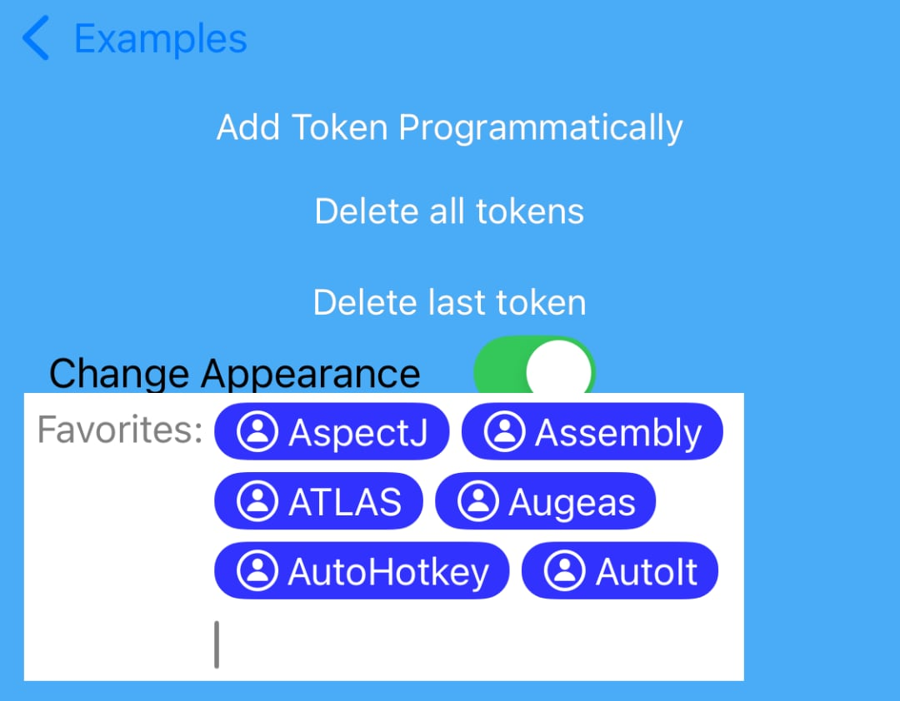
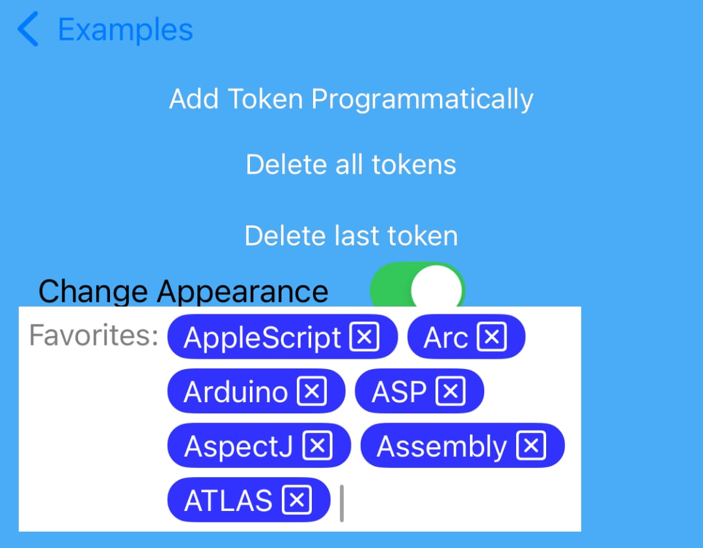

KSTokenView
===========
KSTokenView is a control that displays a collection of tokens in an editable UITextField and sends messages to delegate object. It can also be used to input text from user and perform search operation asynchronously. UI can be fully custimized to look like part of your application.

## Demo
Click [here](https://appetize.io/app/0kzy34tyg761punebrcc1x556w) for Live Preview.
### Vertical


### Horizontal


### Token with image




Token image preferences:
```swift
    let token: KSToken = KSToken(title: names[i], image: tokenImage)
    token.imagePlacement = .left
    token.imageSizeMode = .fontBased(insets: .zero)
    token.imagePadding = 2
    token.contentInset = UIEdgeInsets(top: 2, left: 8, bottom: 2, right: 8)
    tokenView.addToken(token)
```
Handling click on icon by `KSTokenViewDelegate`:
```swift
    func tokenView(_ tokenView: KSTokenView, didClickOnTokenImage token: KSToken) {
        tokenView.deleteToken(token)
    }
```

### Screenshots
[](https://raw.githubusercontent.com/khawars/KSTokenView/screenshots/screenshots/iphone1.png)
[](https://raw.githubusercontent.com/khawars/KSTokenView/screenshots/screenshots/iphone2.png)
[](https://raw.githubusercontent.com/khawars/KSTokenView/screenshots/screenshots/iphone3.png)
[](https://raw.githubusercontent.com/khawars/KSTokenView/screenshots/screenshots/iphone4.png)

## Requirements

- iOS 13 and above.
- Swift 5 and above

## Adding KSTokenView to your project

### METHOD 1: CocoaPods
Add a pod entry for `KSTokenView` to your Podfile

```ruby
target '<Your Target Name>' do
    pod 'KSTokenView', :git => 'https://github.com/Splash04/KSTokenView.git'
end
``` 

Then, run the following command:

```bash
$ pod install
```

### METHOD 2: CocoaPods
Add a pod entry for `KSTokenView` to your Podfile

```ruby
target '<Your Target Name>' do
    pod 'KSTokenView', :git => 'https://github.com/Splash04/KSTokenView.git'
end
``` 

### METHOD 2: Swift Package Manager (Package.swift file)
1. Include the `KSTokenView` package in your list of dependencies:
```ruby
dependencies: [
    .package(url: "https://github.com/Splash04/KSTokenView.git", .upToNextMajor(from: "6.0.0"))
],
``` 

### METHOD 3: Swift Package Manager (Xcode project)
1. In Xcode, navigate to File > Add Packages....
2. In the dialog box that appears, paste the URL of the `KSTokenView` repository (https://github.com/Splash04/KSTokenView.git) into the search bar. Wait for the `KSTokenView` package to appear in the search results.
3. Choose the desired version of the `KSTokenView` package, then click Add Package.
4. Finally, click Add Package to add the selected packages to your project.

### MEHTOD 4: (Source files)
Alternatively, you can directly add all source files under `KSTokenView` to your project.

1. Download the [latest code version](https://github.com/khawars/KSTokenView/archive/master.zip) or add the repository as a git submodule to your git-tracked project.
2. Open your Xcode project, then drag and drop `KSTokenView` directory onto your project. Make sure to select Copy items when asked if you extracted the code archive outside of your project.


## Usage

### Interface Builder
- From interface builder, Drag and drop `UIView` onto your `View`.
- In `Identity inspector`, set custom class `KSTokenView`.
- Create an `outlet` in your source file.
- Customize properties and implement delegates.
```
tokenView.delegate = self
tokenView.promptText = "Top 5: "
tokenView.placeholder = "Type to search"
tokenView.descriptionText = "Languages"
tokenView.maxTokenLimit = 5 //default is -1 for unlimited number of tokens
tokenView.style = .Squared`
```


### Programmatically
Create `KSTokenView` object programmatically and add as `subview`.

```
let tokenView = KSTokenView(frame: CGRect(x: 10, y: 50, width: 300, height: 40))
tokenView.delegate = self
tokenView.promptText = "Top 5: "
tokenView.placeholder = "Type to search"
tokenView.descriptionText = "Languages"
tokenView.maxTokenLimit = 5
tokenView.style = .Squared
view.addSubview(tokenView)
```
### Customization
Customize `KSTokenView` appearance as following

```
/// default is true. token can be deleted with keyboard 'x' button
tokenView.shouldDeleteTokenOnBackspace = true

/// Only works for iPhone now, not iPad devices. default is false. If true, search results are hidden when one of them is selected
tokenView.shouldHideSearchResultsOnSelect = false

/// default is false. If true, already added token still appears in search results
tokenView.shouldDisplayAlreadyTokenized = false

/// default is ture. Sorts the search results alphabatically according to title provided by tokenView(_:displayTitleForObject) delegate
tokenView.shouldSortResultsAlphabatically = true

/// default is true. If false, token can only be added from picking search results. All the text input would be ignored
tokenView.shouldAddTokenFromTextInput = true

/// default is 1
tokenView.minimumCharactersToSearch = 1

/// Default is (TokenViewWidth, 200)
tokenView.searchResultSize = CGSize(width: tokenView.frame.width, height: 120)

/// Default is whiteColor()
tokenView.searchResultBackgroundColor = UIColor.whiteColor()

/// default is UIColor.blueColor()
tokenView.activityIndicatorColor = UIColor.blueColor()

/// default is 120.0. After maximum limit is reached, tokens starts scrolling vertically
tokenView.maximumHeight = 120.0

/// default is UIColor.grayColor()
tokenView.cursorColor = UIColor.grayColor()

/// default is 10.0. Horizontal padding of title
tokenView.paddingX = 10.0

/// default is 2.0. Vertical padding of title
tokenView.paddingY = 2.0

/// default is 5.0. Horizontal margin between tokens
tokenView.marginX = 5.0

/// default is 5.0. Vertical margin between tokens
tokenView.marginY = 5.0

/// default is UIFont.systemFontOfSize(16)
tokenView.font = UIFont.systemFontOfSize(16)

/// default is 50.0. Caret moves to new line if input width is less than this value
tokenView.minWidthForInput = 100.0

/// default is ", ". Used to seperate titles when untoknized
tokenView.seperatorText = ", "

/// default is 0.25.
tokenView.animateDuration = 0.25

/// default is true. When resignFirstResponder is called tokens are removed and description is displayed.
tokenView.removesTokensOnEndEditing = true

/// Default is "selections"
tokenView.descriptionText = "Languages"

/// set -1 for unlimited.
tokenView.maxTokenLimit = 5

/// default is "To: "
tokenView.promptText = "Top 5: "

/// default is true. If false, cannot be edited
tokenView.editable = true

/// default is nil
tokenView.placeholder = "Type to search"

/// default is .Rounded, creates rounded corner
tokenView.style = .Squared

/// default is .Vertical, following creates horizontal scrolling direction
tokenView.direction = .Horizontal

/// An array of string values. Default values are "." and ",". Token is created with typed text, when user press any of the character mentioned in this Array
tokenView.tokenizingCharacters = [","]
```
See example projects for detail.

## License
This code is distributed under the terms and conditions of the [MIT license](LICENSE). 
